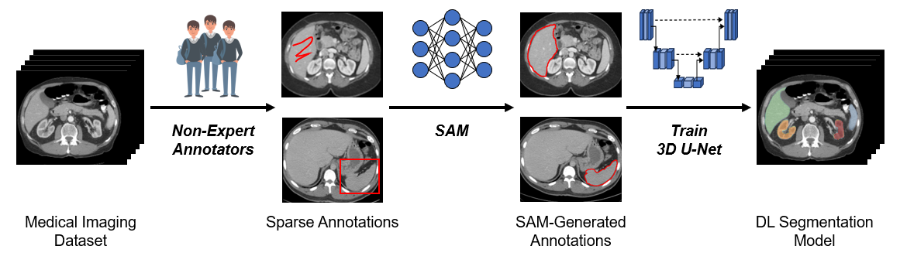

[](https://arxiv.org/abs/2402.05713) [](https://opensource.org/licenses/MIT)

# Anytime, Anywhere, Anyone: Investigating the Feasibility of Segment Anything Model for Crowd-Sourcing Medical Image Annotations
### Pranav Kulkarni*, Adway Kanhere*, Dharmam Savani*, Andrew Chan, Devina Chatterjee, Paul H. Yi, Vishwa S. Parekh

\* Authors contributed equally to this work.



Curating annotations for medical image segmentation is a labor-intensive and time-consuming task that requires domain expertise, resulting in "narrowly" focused deep learning (DL) models with limited translational utility. Recently, foundation models like the Segment Anything Model (SAM) have revolutionized semantic segmentation with exceptional zero-shot generalizability across various domains, including medical imaging, and hold a lot of promise for streamlining the annotation process. However, SAM has yet to be evaluated in a crowd-sourced setting to curate annotations for training 3D DL segmentation models. In this work, we explore the potential of SAM for crowd-sourcing "sparse" annotations from non-experts to generate "dense" segmentation masks for training 3D nnU-Net models, a state-of-the-art DL segmentation model. Our results indicate that while SAM-generated annotations exhibit high mean Dice scores compared to ground-truth annotations, nnU-Net models trained on SAM-generated annotations perform significantly worse than nnU-Net models trained on ground-truth annotations ($p<0.001$, all).

Check out our preprint [here](https://arxiv.org/abs/2402.05713)!

# Datasets

## Medical Segmentation Decathlon (MSD)

We use the liver and spleen datasets from the [MSD collection](http://medicaldecathlon.com/) of benchmark datasets for medical image segmentation. For both datasets, only the provided training set is used in our analysis due to the availability of organ annotations.

## Beyond The Cranial Vault (BTCV)

We use the [BTCV dataset](https://www.synapse.org/#!Synapse:syn3193805) for crowd-sourcing annotations from non-experts for the segmentation of aorta, left and right kidneys, liver, and spleen. The dataset is split into training and testing splits, each with 15 volumes, as follows:

```python
train_ids = [1, 2, 7, 10, 21, 23, 24, 27, 28, 29, 30, 32, 33, 34, 40]
test_ids = [3, 4, 5, 6, 8, 9, 22, 25, 26, 31, 35, 36, 37, 38, 39]
```

Out of the 15 training ids, only 11 were fully annotated:

```python
train_ids = [1, 2, 7, 21, 27, 28, 29, 30, 33, 34, 40]
```

The training ids corresponding to the file name of each NIfTi volume in the dataset. For example, an id of `1` corresponds to the file `image0001.nii.gz`. Due to the research data use agreement, we only provide the training and testing ids as well as crowd-sourced bounding box prompts for the training set.

# Setting Up

## Environment

The complete list of packages used in the environment are included in the [environment.yml](./environment.yml) file. More details can be found in the repository for SAM [here](https://github.com/facebookresearch/segment-anything).

## Segment Anything Model

Place all SAM checkpoints under [checkpoints/](./checkpoints/). The code included in [src/](./src/) provides an interface for SAM to generated annotations using sparse annotations (points, bounding boxes, etc.) with medical images.

# Crowd-Sourcing Annotations

## OpenLabeling Tool

We use the [OpenLabeling tool](https://github.com/Cartucho/OpenLabeling) to crowd-source annotations using images in the [input/](./input/) folder and stores all resulting bounding box prompts in the YOLO format under [input/prompt/](./input/prompt/). The following indices correspond to the organs of interest for our analysis:

```python
0 => Aorta
1 => Right Kidney
2 => Left Kidney
5 => Liver
7 => Aorta
```

These indices corresponding to the indices of the organs in the BTCV dataset. For example, the aorta has index `0` in our prompt, which corresponds to index of `1` in the ground-truth annotations (where `0` is background).

## Generating Segmentation Masks

Segmentation masks are generated for each input image using the bounding box prompts. Finally, the generated masks are stiched together to create the 3D NIfTI volume.

# Results

Detailed results are provided under [here](./results/). We also provide the SAM- and MedSAM-generated annotations for BTCV dataset [here](./results/BTCV/).